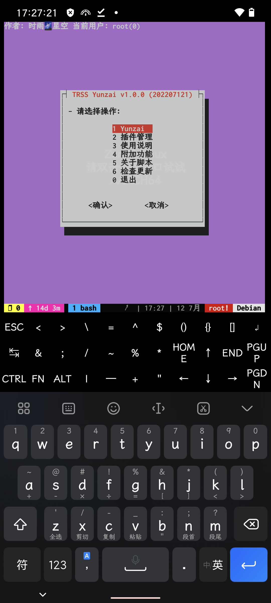
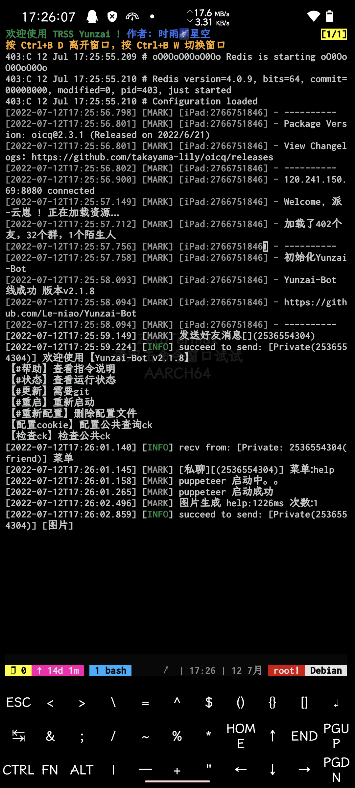
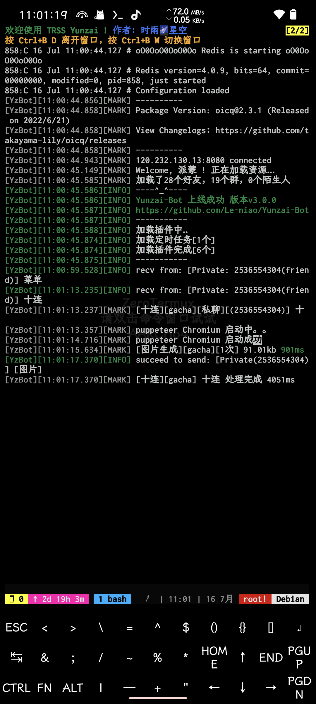
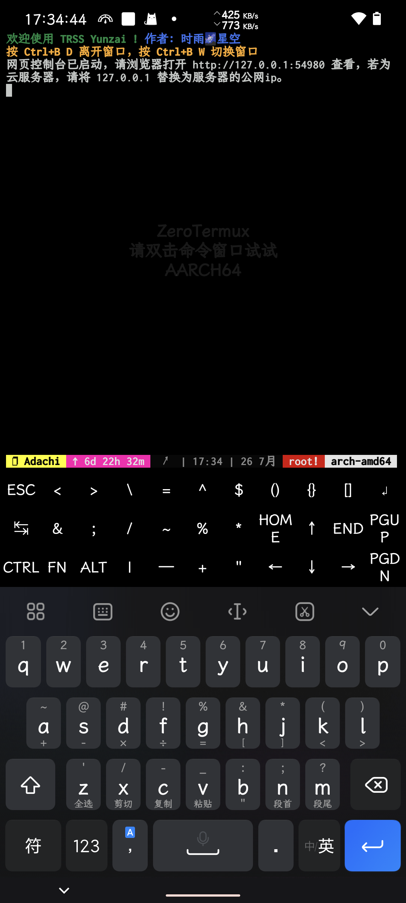

<div align="center">

[](https://moegirl.org.cn/亚托莉)

# TRSS Yunzai

云崽机器人管理脚本

[](../../stargazers)
[](Install.sh)
[](../../releases/latest)

[](https://github.com/TimeRainStarSky/TRSS_Yunzai)

</div>

## 使用教程

1. 准备：[Arch Linux](https://archlinuxcn.org)

- [Windows](https://microsoft.com/windows) 安装教程 [Guide/ArchWSL.md](Guide/ArchWSL.md)
- [Linux](https://kernel.org) / [Mac](https://apple.com/mac) 安装教程 [Guide/Docker.md](Guide/Docker.md)
- [Android](https://github.com/termux/termux-app) / [Linux](https://kernel.org) 安装教程 [Guide/TMOE.md](Guide/TMOE.md)

2. 安装：

```
bash <(curl -L gitee.com/TimeRainStarSky/TRSS_Yunzai/raw/main/Install.sh)
```

3. 启动：`tsyz`

视频教程：<https://bilibili.com/av983453309>

<details><summary>附加功能</summary>

自定义 安装路径 `DIR` 和 启动命令 `CMD`（可用于多开）

举例：将脚本安装至 `/Bot` 启动命令 `trss`

```
DIR=/Bot CMD=trss bash <(x
```

</details>

## 使用说明

- [Yunzai](https://github.com/Le-niao/Yunzai-Bot) <-调用-> [OICQ](https://oicqjs.github.io/oicq) <-网络连接-> [QQ 服务器](https://im.qq.com)
- [OICQ](https://oicqjs.github.io/oicq)：提供 QQ 账号管理，收发消息等功能
- [Yunzai](https://github.com/Le-niao/Yunzai-Bot)：对消息进行处理，完成目标操作
- WSL / Docker / chroot 容器：程序运行于容器环境，不易受主机系统环境影响
- Dialog 对话框：支持 触屏 / 鼠标 操作的交互式对话框
- [Tmux 终端复用器](https://github.com/tmux/tmux)：支持 触屏 / 鼠标 操作的交互式终端会话
- [Micro 文本编辑器](https://micro-editor.github.io)：支持 触屏 / 鼠标 操作的终端文本编辑器
- [Ranger 文件管理器](https://ranger.github.io)：支持 触屏 / 鼠标 操作的终端文件管理器
- 插件管理：一键 安装 / 管理 插件，无需输入复杂安装命令
- 滚动更新：实时更新到最新版本，修复已知问题并添加更多功能
- 更多功能等待你来提出……

## 常见问题

<details><summary>展开</summary>

- 问：发消息错误：46
- 答：账号被风控

- 问：请先开启 Redis
- 答：脚本会自动在后台启动 Redis，如果遇到这种情况，说明 Redis 未正常启动，请在终端中输入`redis-server`查看具体问题

- 问：address already in use
- 答：端口被占用，请尝试停止占用进程、重启设备，或修改配置文件，更改端口

- 问：open terminal failed: not a terminal
- 答：TMOE PRoot 容器首次启动会出现，重启容器就行了

- 问：[server exited unexpectedly]
- 答：tmux 进程意外退出，可能是系统资源不足引起的，如果在 Termux 中经常出现，请检查设置：电池优化、后台运行权限

- 问：我有其他问题
- 答：提供详细问题描述，通过下方 联系方式 反馈问题

</details>

## 联系方式

- QQ 群组：[211414032](https://jq.qq.com/?k=QU1xGLEB)

### 时雨🌌星空

- GitHub：[TimeRainStarSky](https://github.com/TimeRainStarSky)
- 酷安：[时雨丶星空](http://www.coolapk.com/u/2650948)
- QQ：[2536554304](https://qm.qq.com/cgi-bin/qm/qr?k=x8LtlP8vwZs7qLwmsbCsyLoAHy7Et1Pj)
- Telegram：[TimeRainStarSky](https://t.me/TimeRainStarSky)

## 赞助支持

- 爱发电：<https://afdian.net/a/TimeRainStarSky>
- Partme：<https://partme.com/TimeRainStarSky>

## 界面展示

<details><summary>展开</summary>

[](https://github.com/TimeRainStarSky/TRSS_Yunzai)
[](https://github.com/TimeRainStarSky/Yunzai-Bot-2)
[](https://github.com/Le-niao/Yunzai-Bot)
[](https://docs.adachi.top)

</details>

## 相关项目

[](../../../TRSS_Liteyuki)
[](../../../TRSS_Yunzai)
[](../../../TRSS_Sagiri)
[](../../../TRSS_OneBot)
[](../../../TRSS_Amiya)
[](../../../TRSS_Zhenxun)
